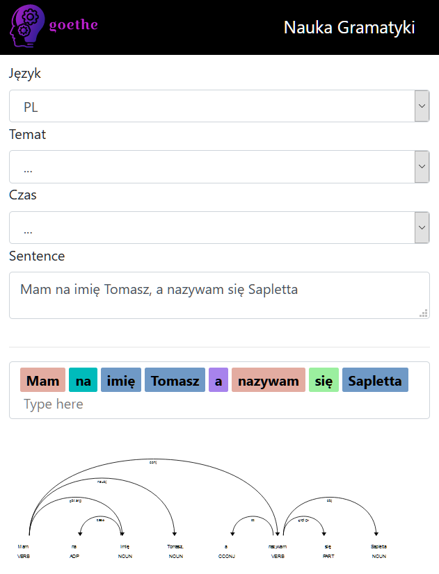

# app-python
Environment based on python

## TODO

+ przygotowac zadania json
+ syncrhonizacja textarea z input z przecinkami w obie strony
+ konfiguracja: legenda kolorow do wyboru za pomoca radiobuttonow (jeden rozny kolor na jedna czcesc zdania)
+ lista nazw czesc zdania w tabelce/json w roznych jezykach
+ tworzenie tabel z json, jaka biblioteka robi to efektywnie i malo zajmuje + filtrowanie z memory + komendy z API

## Przykład

